### All-weather Multi-Modality Image Fusion: Unified Framework and 100k Benchmark 
### [Arxiv](https://arxiv.org/abs/2402.02090) | [Code](https://github.com/ixilai/AWFusion) 
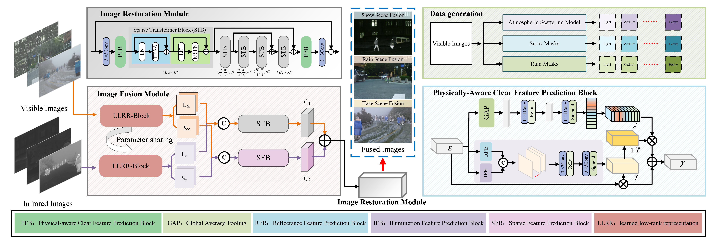

## Requirements

* Python 3.10
* PyTorch 1.12
* TorchVision 0.13.0
* Kornia 0.6.5

## Dataset
* Our AWMM-100k is available at [Link](https://feecuin.github.io/), the preview of our dataset is as follows.
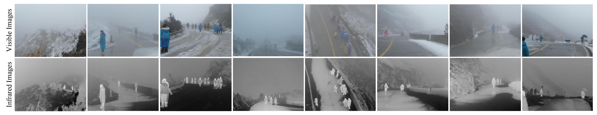

## To train

### Traning Stage 1: AWFusion Teacher Net
You need to go into `train_teacher.py` first to set parameters such as the path and save path of the training data
* Run `torchrun --nproc_per_node = (The number of GPUs you have) train_teacher.py`

### Traning Stage 2: AWFusion Student Net

In training stage 1, you should train three teacher models (corresponding to rain, haze, and snow respectively)
* You need to go into `train_student.py` 
Then go to `train_student.py` to complete the teacher model path and the training data path
* Run `torchrun --nproc_per_node = (The number of GPUs you have) train_student.py`

## To Test
The pretrain weights is at [Baidu Drive](https://pan.baidu.com/s/1XTlnTZigqaMGhnSyEi9ytg) (code: m3ru) | [Google Drive](https://drive.google.com/file/d/1hk_4XUKz2ZzlxhRfRIQ2oqMDwQynvpun/view?usp=drive_link).

### **Task #1: Clean Image Fusion**

Run
`python test_AWF_clean.py --ir_path Ir_Image_For_testing --vi_path Vi_Image_For_testing --deweather_ckpt Allweather_Fuse.pth --save_path Result_save_path`


### **Task #2: All Weather Image Fusion (Single Weather Interference)**

Run
`python test_AWF_singleweather.py --ir_path Ir_Image_For_testing --vi_path Vi_Image_For_testing --deweather_ckpt Allweather_Fuse.pth --save_path result_save_path`

### Task #3: All Weather Image Fusion (Multitype Weather Interference)
Run
`python test_AWF_Multiweather.py --ir_path Ir_Image_For_testing --vi_path Vi_Image_For_testing --deweather_ckpt Allweather_Fuse.pth --save_path result_save_path`

## Image Dehazing
<table border="0" cellspacing="0" cellpadding="0">
  <tr>
    <td align="center"><b>Input Visible Image</b></td>
    <td align="center"><b>Input Infrared Image</b></td>
    <td align="center"><b>Restoration Process</b></td>
    <td align="center"><b>Fusion Result</b></td>
  </tr>
  <tr>
    <td>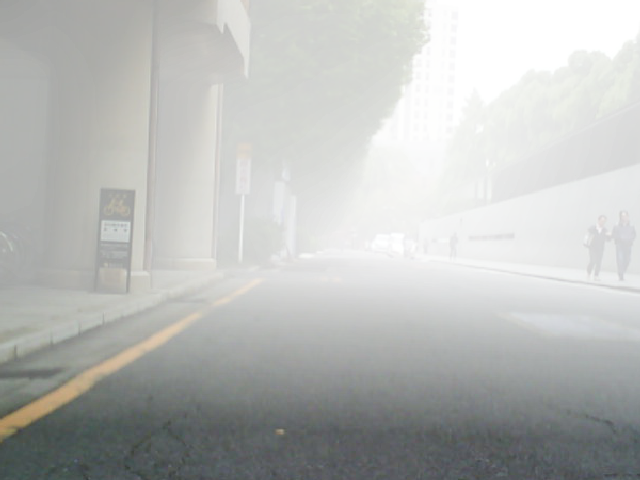</td>
    <td>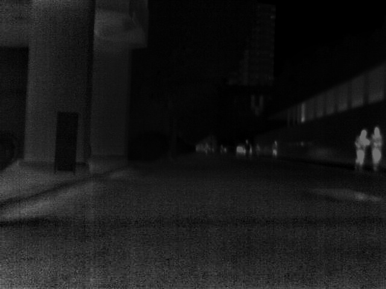</td>
    <td></td>
    <td>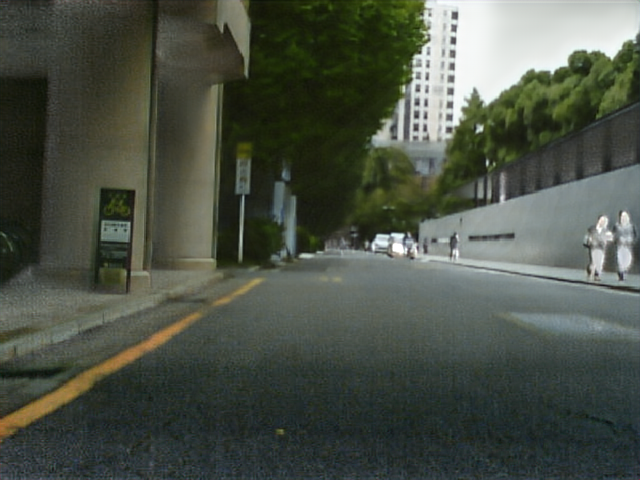</td>
  </tr>
</table>

## Image Desnowing
<table border="0" cellspacing="0" cellpadding="0">
  <tr>
    <td align="center"><b>Input Visible Image</b></td>
    <td align="center"><b>Input Infrared Image</b></td>
    <td align="center"><b>Restoration Process</b></td>
    <td align="center"><b>Fusion Result</b></td>
  </tr>
  <tr>
    <td>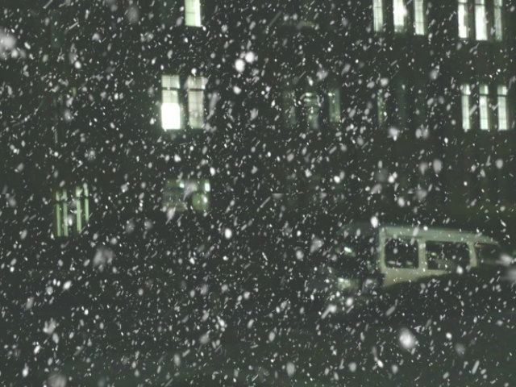</td>
    <td>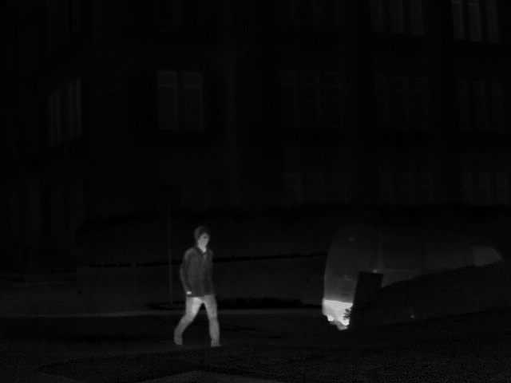</td>
    <td></td>
    <td>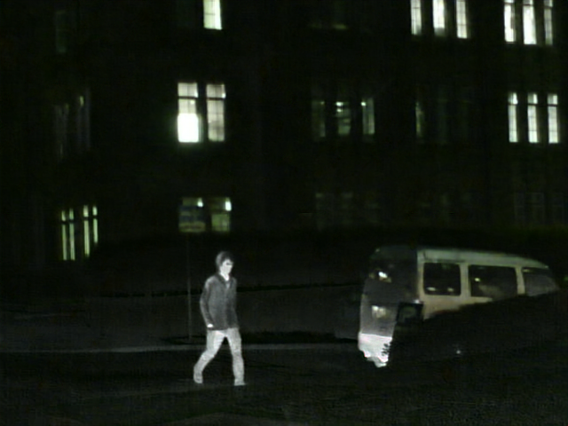</td>
  </tr>
</table>

## Image Deraining
<table border="0" cellspacing="0" cellpadding="0">
  <tr>
    <td align="center"><b>Input Visible Image</b></td>
    <td align="center"><b>Input Infrared Image</b></td>
    <td align="center"><b>Restoration Process</b></td>
    <td align="center"><b>Fusion Result</b></td>
  </tr>
  <tr>
    <td>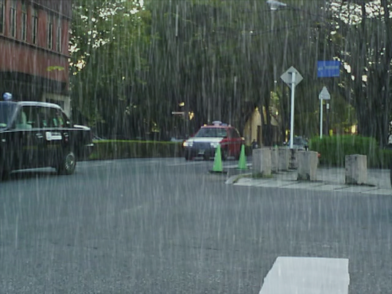</td>
    <td>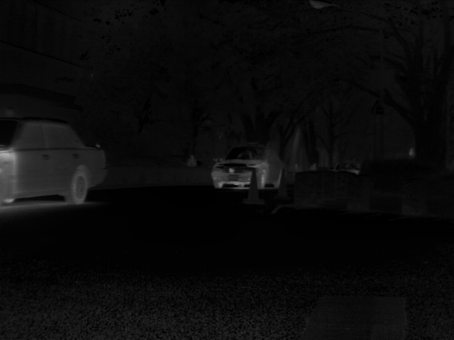</td>
    <td></td>
    <td>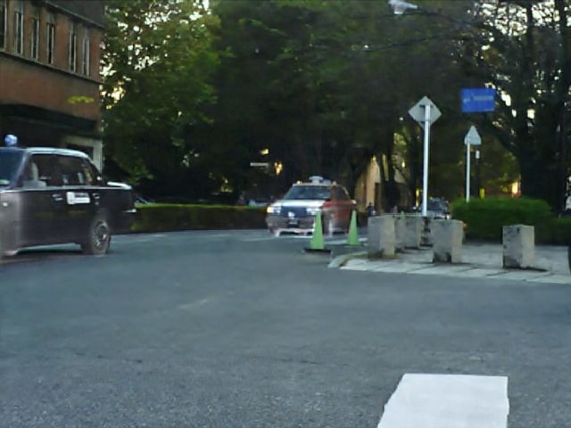</td>
  </tr>
</table>

## Image Dehazing & Deraining
<table border="0" cellspacing="0" cellpadding="0">
  <tr>
    <td align="center"><b>Input Visible Image</b></td>
    <td align="center"><b>Input Infrared Image</b></td>
    <td align="center"><b>Restoration Process</b></td>
    <td align="center"><b>Fusion Result</b></td>
  </tr>
  <tr>
    <td>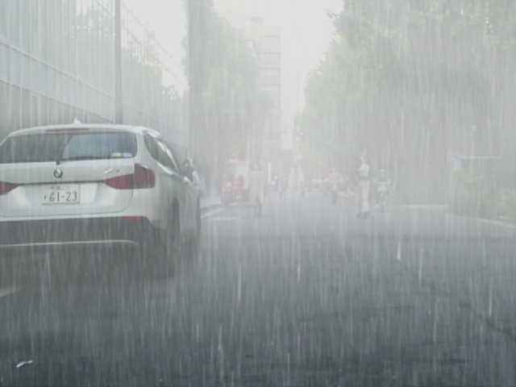</td>
    <td>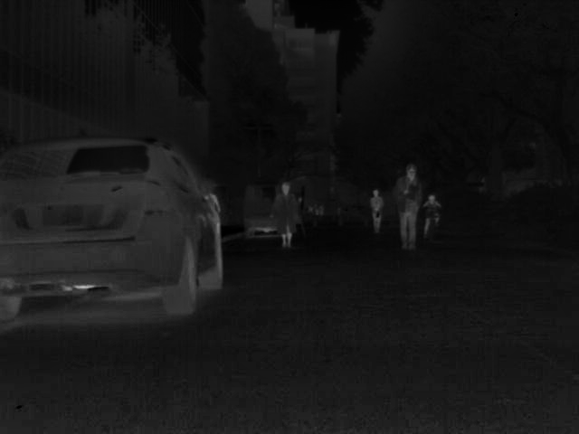</td>
    <td></td>
    <td>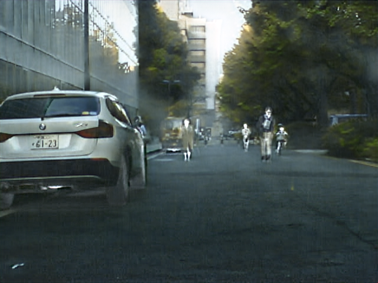</td>
  </tr>
</table>


## Gallery


Fig1. Comparison of fusion results obtained by the proposed algorithm under haze weather and the results of the comparison methods under ideal condition.


Fig2. Comparison of fusion results obtained by the proposed algorithm under snow weather and the results of the comparison methods under ideal condition.


Fig3. Comparison of fusion results obtained by the proposed algorithm under rain weather, and the results of the comparison methods under ideal condition.


## Citation
If you find our work useful for your research, please cite our paper. 
```
@article{li2024all,
  title={All-weather Multi-Modality Image Fusion: Unified Framework and 100k Benchmark},
  author={Li, Xilai and Liu, Wuyang and Li, Xiaosong, Zhou Fuqiang, Li Huafeng and Nie Feiping},
  journal={arXiv preprint arXiv:2402.02090v2},
  year={2024}
}

```
